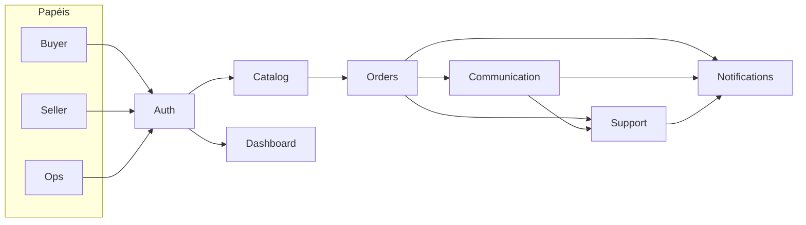

# Market Hub

Solução full-stack do desafio de marketplace: o vendedor opera pedidos, o
comprador conversa no contexto do item e o time de Ops atende a fila por
prioridade, com notificação in-app e e-mail simulado quando a prioridade
efetiva vira `high` ou `critical`.

Repositório: https://github.com/giordani-p/market-hub

O detalhe de contratos, decisões e o que ficou fora de escopo está em
[`docs/CURRENT_STATE.md`](docs/CURRENT_STATE.md).

## Stack

- Backend: **Python 3.12** + FastAPI, SQLAlchemy, Alembic, JWT
- Frontend: React + TypeScript (Vite)
- Dados: PostgreSQL 16
- Jobs (opcional): Worker Python + SQS no LocalStack

## O que o produto faz

Três papéis, um login. Não há cadastro público: os usuários vêm da seed.

- **Entrada**: `/login` (marca, benefícios da operação, validação em
  português).
- **Buyer**: catálogo em `/catalog` com busca (nome e descrição), faixa de
  preço, somente disponíveis, ordenação (menor preço, maior preço, nome) e
  paginação de 24 — filtros na URL. O card mostra o menor preço e em quantas
  lojas o produto está; sem oferta comprável, "Sem estoque". Checkout,
  pedidos, conversa no Order Item, cancelamento em `placed`/`preparing`.
  Início em `/buyer`.
- **Seller** (foco operacional): dashboard, pedidos com filtro e busca,
  avançar e cancelar status, conversa Buyer↔Seller, comentários internos
  com Ops, CRUD de ofertas e produtos em `/seller/offers`, prioridade
  efetiva da conversa.
- **Ops**: dashboard, fila de conversas `open` por prioridade
  (`critical > high > medium > low`), override `critical`, Order Items
  globais, comentários internos. Ops **não** lê Messages (privacidade).
- **Transversal**: JWT, notificações in-app (sino, marcar lidas, deep link)
  e e-mail simulado no log do Worker quando `effective_priority` vira
  `high` ou `critical`.

Fora de escopo: pagamento, entrega, cadastro público, realtime/WebSocket,
SMTP real, Slack/SMS, filtro de catálogo no servidor, categoria e imagem
de produto (não existem no domínio).

## Domínios

Catalog (Produto/Oferta) alimenta Orders. O **Order Item** é o contexto da
Communication (Buyer↔Seller) e do Support (Seller↔Ops + fila por
prioridade). Notifications é o Job após o commit. Dashboard só lê, sem
persistência própria. Jobs/SQS são infra — citados na stack, não neste
mapa.



## Requisitos

- Python 3.12 ou superior
- [uv](https://docs.astral.sh/uv/)
- Docker, para o Postgres local, o LocalStack e o Worker
- Node 20 ou superior, para o frontend

## Como executar

1. Copie o exemplo de ambiente e preencha Postgres, `JWT_SECRET` e
   `SEED_PASSWORD`. `CORS_ORIGINS` já inclui `http://localhost:5173`.

```bash
cp .env.example .env
```

Variáveis: `DATABASE_URL`, `TEST_DATABASE_URL`, `POSTGRES_USER`,
`POSTGRES_PASSWORD`, `POSTGRES_DB`, `JWT_SECRET`, `SEED_PASSWORD`. O
arquivo `.env` nunca é commitado, nem qualquer valor de credencial.

2. Backend:

```bash
make install
make reset             # recria o volume do Postgres, aplica migrations e a seed completa
make run               # http://localhost:8000  — rotas em /v1, docs em /docs
```

`make reset` executa `docker compose down -v`, sobe o Postgres, `make migrate`
e `make seed`. Apaga **todos** os dados locais do Postgres (app e banco de
teste). `make db-down` só derruba os containers e **não** apaga o volume.

Ambiente que já tem o banco: `make migrate` e `make seed` (a seed é
idempotente). Equivalente ao reset: `make db-up`, `make migrate`, `make seed`.

3. Frontend (segundo terminal):

```bash
cd frontend
npm install
npm run dev            # http://localhost:5173
```

A API default do cliente é `http://localhost:8000/v1`. Defina
`VITE_API_BASE_URL` só se a API não estiver nesse endereço.

4. Worker (opcional — reconciliação de prioridade e e-mail simulado):

```bash
make jobs-up           # sobe Postgres, LocalStack e o Worker
make enqueue-reconcile # publica RECONCILE_PRIORITIES na hora, sem esperar 15 min
docker compose logs -f worker
```

`make jobs-up` **não** entra no `reset`: rode depois se quiser LocalStack e
Worker (as filas são recriadas; o Worker já vê o banco populado).

O e-mail de alerta (prioridade `high`/`critical`) é simulado no log do
Worker, não na API. Destinatário extra opcional:
`NOTIFICATION_EMAIL_EXTRA_TO` no `.env`; reinicie o Worker depois de mudar.

A Rule do EventBridge no LocalStack é mock e **não** dispara a fila; no AWS
real o mapeamento continua Scheduler → SQS. Use `make enqueue-reconcile`
para não esperar 15 minutos. `make test` não sobe LocalStack.

### Contas de demonstração

Senha de todos: o valor de `SEED_PASSWORD`.

| Papel  | E-mail                 | Para explorar                                      |
| ------ | ---------------------- | -------------------------------------------------- |
| Seller | `loja-a@example.com`   | pedidos, conversas, notificações, ofertas          |
| Seller | `loja-b@example.com`   | segundo vendedor                                   |
| Buyer  | `buyer@example.com`    | catálogo, pedidos, conversa                        |
| Ops    | `ops@example.com`      | fila e override `critical`                         |

A seed completa cria 20 users (8 sellers, 11 buyers, 1 ops), 32 produtos,
ofertas, pedidos em todos os status e jornadas. Os demais e-mails seguem
`*@example.com` com a mesma senha. Loja A, Buyer Demo e Ops Demo já entram
com pedidos, conversas e notificações. Os testes usam só a identidade
mínima (Loja A, Loja B, Buyer Demo, Ops Demo).

## Testes

Os testes de backend usam o mesmo Postgres do `docker-compose`, no banco
indicado por `TEST_DATABASE_URL`. Suba o banco antes de testar.

```bash
make db-up && make test && make lint   # backend (Postgres no ar; sem LocalStack)
cd frontend && npm test && npm run lint
```

Contrato da API escrito à mão: [`api/openapi.yaml`](api/openapi.yaml).
Documentação interativa: `http://localhost:8000/docs`.

## Onde ler mais

- Estado, contratos e decisões: [`docs/CURRENT_STATE.md`](docs/CURRENT_STATE.md)
- Produto e domínios: [`docs/Project_Context.md`](docs/Project_Context.md)
- Enunciado do desafio: [`docs/challenge.md`](docs/challenge.md)
- Frontend (estrutura, tokens, primitivos): [`frontend/README.md`](frontend/README.md)
